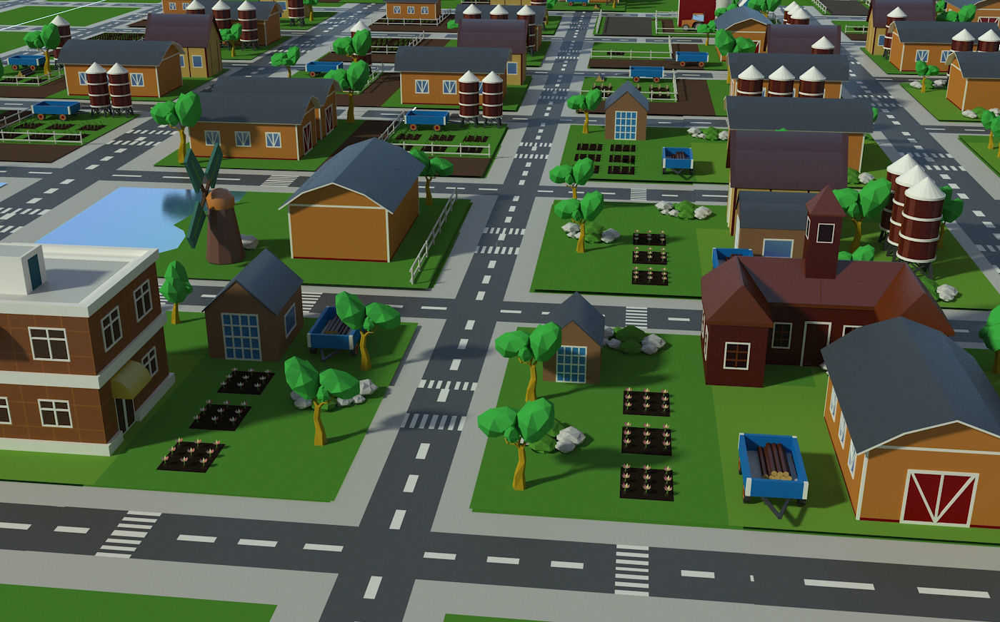

# Timpanus
A TimpanusTeam Game

Elements mapa:

 - casa -> meva casa amb jardi (devant darrere)
 - casa -> radio
 - casa -> veí q es queixa
 - casa -> ???
 - carretera

Elements:

 - gos
 - joguina gos
 - nota -> "he deixat joguina del gos a darrera"
 - clau
 - veí persona
 - radio
 - telefon

Coses que et maten (invisibles):

 - cotxe
 - foc a la cuina

Inspiration

## Packages used

* System Input
* High Definition RP

## Assets used

* [Simple FP Controller (magicdidac)](https://magicdvstudio.com/assets/simpleFirstPersonController.unitypackage)
* [Audio Manager (magicdidac)](https://magicdvstudio.com/assets/AudioManager_by_magicdidac.unitypackage)
